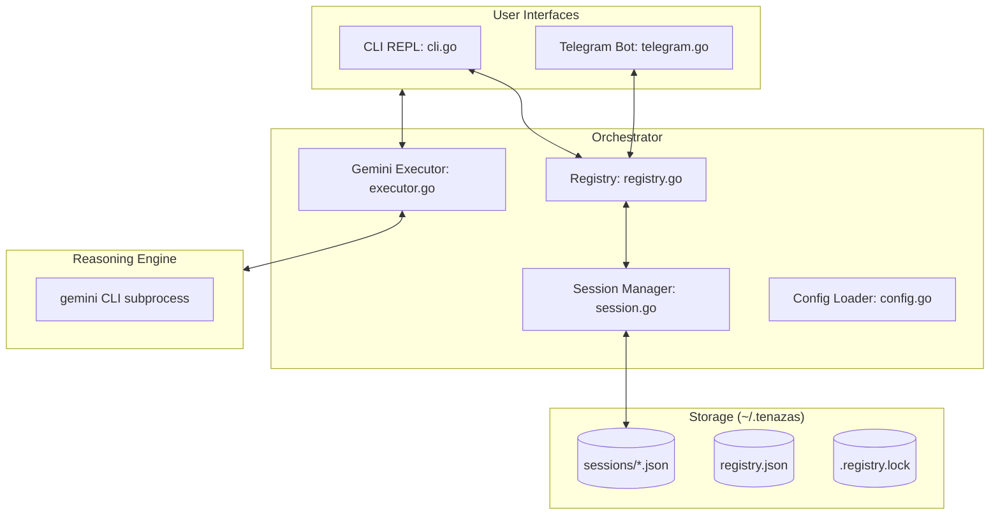

# Tenazas: Technical Architecture & Development Guide

Tenazas is a high-performance, zero-dependency Go gateway for the `gemini` CLI. It enables seamless session handoff between local terminal environments and remote Telegram interfaces while maintaining full filesystem awareness.

## 1. Core Philosophy
- **Zero Dependencies**: Built strictly with the Go Standard Library (plus `google/uuid` for ID generation).
- **Session-Centric**: The source of truth is the session file, not the interface.
- **Environment-Anchored**: Every session is tied to a specific local directory (`CWD`).
- **Audit-Ready**: Minimal codebase (~2,000 LOC) designed for high security and transparency.

## 2. Architecture Overview

## 3. Component Deep Dive

### `session.go` (The State)
Manages the lifecycle of a session.
- **Data Model**: Stores Tenazas UUID, the native `gemini_sid`, the `cwd` (anchor path), and the session `title`.
- **Persistence**: Atomic JSON writes to `~/.tenazas/sessions/`.
- **Pagination**: Supports high-performance directory scanning and sorting for the `/resume` interface.

### `executor.go` (The Bridge)
Orchestrates the `gemini` CLI subprocess.
- **JSONL Parsing**: Reads the `--output-format json-stream` from `stdout`.
- **Session Continuity**: Uses `--resume <GeminiSID>` for follow-up prompts.
- **CWD Injection**: Strictly sets `cmd.Dir` to the session's anchored path.
- **Logging**: Captures `stderr` to `tenazas.log` for background diagnostics.

### `registry.go` (Multi-Process Sync)
Ensures multiple CLIs and the Telegram daemon don't collide.
- **Flock Logic**: Uses `syscall.Flock` (Advisory Locking) on `.registry.lock`.
- **Mapping**: Pairs an `InstanceID` (e.g., `cli-PID` or `tg-ChatID`) to a `SessionID`.
- **Process Isolation**: Allows multiple terminal windows to maintain independent active sessions.

### `telegram.go` (Zero-SDK Gateway)
A raw HTTP implementation of the Telegram Bot API.
- **Long Polling**: Uses `getUpdates` with a 30s timeout.
- **Streaming Buffer**: Accumulates Gemini chunks and updates Telegram via `editMessageText` every `UpdateInterval` (default 500ms) to bypass rate limits.
- **Security**: Whitelist-based access via `AllowedUserIDs`.

### `cli.go` (The Local REPL)
Provides the terminal interface.
- **Streaming**: Real-time `fmt.Print` of Gemini chunks.
- **Menu**: Interactive paginated list for session resumption.

## 4. Operational Details

### Storage Layout (`~/.tenazas`)
- `config.json`: Global settings.
- `registry.json`: Instance-to-session mapping.
- `.registry.lock`: System-level lock file.
- `tenazas.log`: Combined `stderr` from Gemini processes.
- `sessions/`: UUID-named JSON files containing session metadata.

### Configuration
Config is loaded via `~/.tenazas/config.json`, then overridden by Environment Variables:
- `TENAZAS_TG_TOKEN`: Telegram Bot Token.
- `TENAZAS_ALLOWED_IDS`: Comma-separated list of Telegram User IDs.
- `TENAZAS_STORAGE_DIR`: Override for `~/.tenazas`.

### Handoff Flow
1. **Desktop**: User starts `tenazas` in `~/projects/api`. A session is created, anchored to that path.
2. **Mobile**: User sends a message to the TG bot.
3. **Logic**: The bot sees no active session for that `ChatID`. It loads the `latest` updated session from disk.
4. **Execution**: The bot spawns `gemini --resume <SID>` with `cmd.Dir = "~/projects/api"`.
5. **Result**: Seamless continuity across platforms.

## 5. Development Guidelines
- **No Heavy Imports**: Keep the binary lean. Avoid external SDKs.
- **Lock First**: Always wrap Registry or Session writes in the locking logic.
- **Path Safety**: Always use `filepath.Join` and validate paths before `os.MkdirAll`.
- **CLI Compatibility**: Maintain parity with the `gemini` CLI's JSONL schema (`type`, `session_id`, `content`, `delta`).
