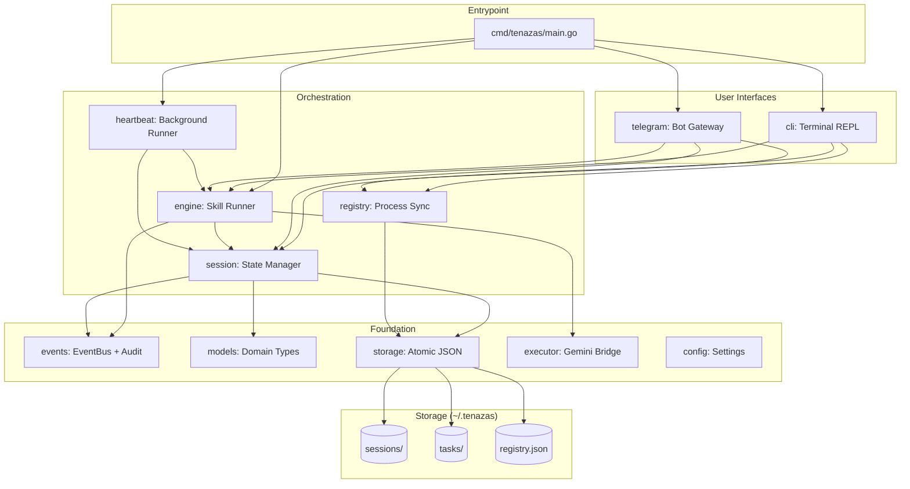

# Tenazas: Technical Architecture & Development Guide

Tenazas is a high-performance, zero-dependency Go gateway for the `gemini` CLI. It enables seamless session handoff between local terminal environments and remote Telegram interfaces while maintaining full filesystem awareness.

## 1. Core Philosophy
- **Zero Dependencies**: Built strictly with the Go Standard Library (plus `google/uuid` for ID generation).
- **Session-Centric**: The source of truth is the session file, not the interface.
- **Environment-Anchored**: Every session is tied to a specific local directory (`CWD`).
- **Audit-Ready**: Minimal codebase (~2,000 LOC) designed for high security and transparency.

## 2. Project Structure

```
cmd/tenazas/main.go              ← Thin entrypoint, wires all packages
internal/
  config/config.go               ← Config struct, Load(), env var overrides
  events/events.go               ← EventBus, AuditEntry, TaskStatusPayload, constants
  models/models.go               ← Session, SkillGraph, StateDef, Heartbeat, EngineInterface
  storage/storage.go             ← Atomic JSON I/O, Slugify, path resolution
  session/session.go             ← Session CRUD, audit log, skill registry, listing
  registry/registry.go           ← Flock-based instance-to-session mapping
  executor/executor.go           ← Gemini subprocess, JSONL parsing
  engine/
    engine.go                    ← Skill execution loop, intervention, prompt building
    thought_parser.go            ← Chain-of-thought stream parser
  skill/skill.go                 ← Skill loading and listing
  task/
    task.go                      ← Task model, CRUD, cycle detection, archival
    work.go                      ← `tenazas work` CLI subcommand
  heartbeat/heartbeat.go         ← Background task runner, Notifier interface
  telegram/telegram.go           ← Telegram bot (polling, streaming, callbacks)
  cli/
    cli.go                       ← Terminal REPL, branding, drawer, completions
    terminal_darwin.go           ← macOS raw mode / terminal size
    terminal_linux.go            ← Linux raw mode / terminal size
  formatter/formatter.go         ← AnsiFormatter (CLI), HtmlFormatter (Telegram)
```

## 3. Architecture Overview



## 4. Dependency Rules

Packages follow a strict layered dependency graph. **No circular imports.**

```
Layer 0 (no internal deps):  events, models, storage, executor, config
Layer 1 (foundation deps):   formatter → events
                              registry → storage
                              skill → config, models, storage
                              task → storage
Layer 2 (mid-tier):          session → events, models, skill, storage
Layer 3 (orchestration):     engine → events, executor, models, session
Layer 4 (top-tier):          heartbeat → engine, events, models, session, storage, task
                              telegram → events, formatter, models, registry, session
                              cli → engine, events, formatter, models, registry, session, skill
Layer 5 (entrypoint):        cmd/tenazas → all of the above
```

**Circular dependency breakers:**
- `heartbeat` uses a `Notifier` interface (not `*telegram.Telegram` directly)
- `models.EngineInterface` allows telegram/cli/heartbeat to reference engine behavior without importing engine

## 5. Component Deep Dive

### `internal/session` (The State)
Manages the lifecycle of a session.
- **Data Model**: Stores Tenazas UUID, the native `gemini_sid`, the `cwd` (anchor path), and the session `title`.
- **Persistence**: Atomic JSON writes to project-specific subdirectories in `~/.tenazas/sessions/`.
- **Pagination**: Supports high-performance directory scanning and sorting for the `/resume` interface.

### `internal/executor` (The Bridge)
Orchestrates the `gemini` CLI subprocess.
- **JSONL Parsing**: Reads the `--output-format json-stream` from `stdout`.
- **Session Continuity**: Uses `--resume <GeminiSID>` for follow-up prompts.
- **CWD Injection**: Strictly sets `cmd.Dir` to the session's anchored path.
- **Logging**: Captures `stderr` to `tenazas.log` for background diagnostics.

### `internal/registry` (Multi-Process Sync)
Ensures multiple CLIs and the Telegram daemon don't collide.
- **Flock Logic**: Uses `syscall.Flock` (Advisory Locking) on `.registry.lock`.
- **Mapping**: Pairs an `InstanceID` (e.g., `cli-PID` or `tg-ChatID`) to a `SessionID`.
- **Process Isolation**: Allows multiple terminal windows to maintain independent active sessions.

### `internal/telegram` (Zero-SDK Gateway)
A raw HTTP implementation of the Telegram Bot API.
- **Long Polling**: Uses `getUpdates` with a 30s timeout.
- **Streaming Buffer**: Accumulates Gemini chunks and updates Telegram via `editMessageText` every `UpdateInterval` (default 500ms) to bypass rate limits.
- **Security**: Whitelist-based access via `AllowedUserIDs`.

### `internal/cli` (The Local REPL)
Provides the terminal interface.
- **Streaming**: Real-time `fmt.Print` of Gemini chunks.
- **Menu**: Interactive paginated list for session resumption.
- **Immersive Mode**: Split-pane with thought drawer and footer bar.

### `internal/engine` (The Brain)
Drives the skill execution loop.
- **Intervention System**: Pause/retry/abort for failed tool calls.
- **Thought Parser**: Extracts chain-of-thought from streaming responses.
- **Max Loops**: Configurable safety limit on autonomous iterations.

### `internal/heartbeat` (Background Runner)
Periodically scans for pending heartbeat files and runs skills automatically.
- **Decoupled**: Uses `Notifier` interface instead of concrete Telegram dependency.
- **Task Lifecycle**: Emits `TaskState` events (started/blocked/completed/failed).

## 6. Operational Details

### Storage Layout (`~/.tenazas`)
- `config.json`: Global settings.
- `registry.json`: Instance-to-session mapping.
- `.registry.lock`: System-level lock file.
- `tenazas.log`: Combined `stderr` from Gemini processes.
- `sessions/`: Project-specific subdirectories containing UUID-named JSON files.
- `tasks/`: Project-specific subdirectories containing task Markdown files.

### Configuration
Config is loaded via `~/.tenazas/config.json`, then overridden by Environment Variables:
- `TENAZAS_TG_TOKEN`: Telegram Bot Token.
- `TENAZAS_ALLOWED_IDS`: Comma-separated list of Telegram User IDs.
- `TENAZAS_STORAGE_DIR`: Override for `~/.tenazas`.

### Handoff Flow
1. **Desktop**: User starts `tenazas` in `~/projects/api`. A session is created, anchored to that path.
2. **Mobile**: User sends a message to the TG bot.
3. **Logic**: The bot sees no active session for that `ChatID`. It loads the `latest` updated session from disk.
4. **Execution**: The bot spawns `gemini --resume <SID>` with `cmd.Dir = "~/projects/api"`.
5. **Result**: Seamless continuity across platforms.

## 7. Development Guidelines
- **No Heavy Imports**: Keep the binary lean. Avoid external SDKs.
- **Lock First**: Always wrap Registry or Session writes in the locking logic.
- **Path Safety**: Always use `filepath.Join` and validate paths before `os.MkdirAll`.
- **CLI Compatibility**: Maintain parity with the `gemini` CLI's JSONL schema (`type`, `session_id`, `content`, `delta`).
- **Respect Layer Boundaries**: Never import a higher-layer package from a lower-layer one.
- **Tests Co-located**: Every `_test.go` file lives in the same directory as the code it tests.
