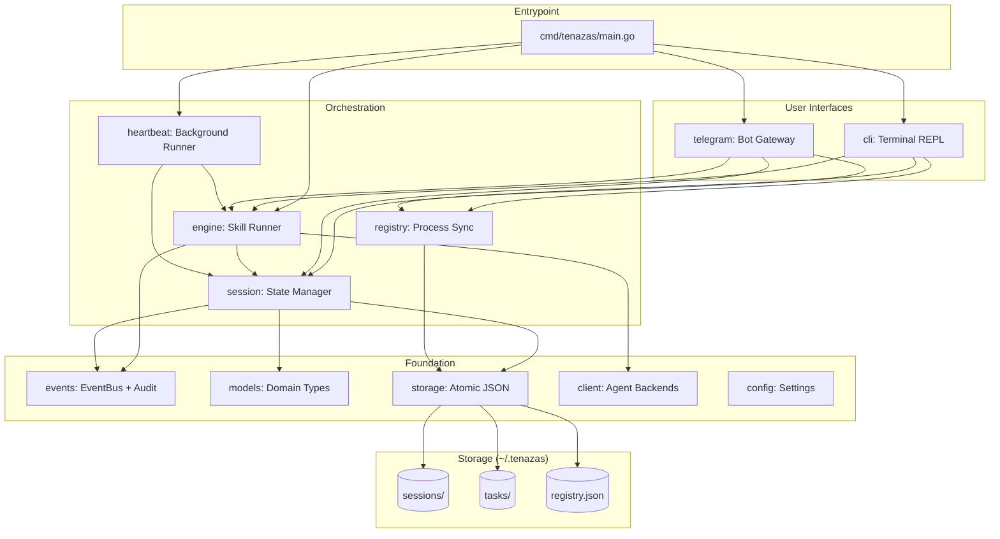

# Tenazas: Technical Architecture & Development Guide

Tenazas is a high-performance, zero-dependency Go gateway for coding-agent CLIs (Gemini, Claude Code, and more). It enables seamless session handoff between local terminal environments and remote Telegram interfaces while maintaining full filesystem awareness.

## 1. Core Philosophy
- **Zero Dependencies**: Built strictly with the Go Standard Library (plus `google/uuid` for ID generation).
- **Session-Centric**: The source of truth is the session file, not the interface.
- **Environment-Anchored**: Every session is tied to a specific local directory (`CWD`).
- **Audit-Ready**: Minimal codebase (~2,000 LOC) designed for high security and transparency.

## 2. Project Structure

```
cmd/tenazas/main.go              ← Thin entrypoint, wires all packages
internal/
  config/config.go               ← Config struct, Load(), env var overrides
  events/events.go               ← EventBus, AuditEntry, TaskStatusPayload, constants
  models/models.go               ← Session, SkillGraph, StateDef, Heartbeat, EngineInterface
  storage/storage.go             ← Atomic JSON I/O, Slugify, path resolution
  session/session.go             ← Session CRUD, audit log, skill registry, listing
  registry/registry.go           ← Flock-based instance-to-session mapping
  client/
    client.go                    ← Client interface, registry, factory
    gemini.go                    ← GeminiClient: gemini CLI subprocess, JSONL parsing
    claude_code.go               ← ClaudeCodeClient: claude CLI subprocess
  engine/
    engine.go                    ← Skill execution loop, intervention, prompt building
    thought_parser.go            ← Chain-of-thought stream parser
  skill/skill.go                 ← Skill loading and listing
  task/
    task.go                      ← Task model, CRUD, cycle detection, archival
    work.go                      ← `tenazas work` CLI subcommand
  heartbeat/heartbeat.go         ← Background task runner, Notifier interface
  telegram/telegram.go           ← Telegram bot (polling, streaming, callbacks)
  cli/
    cli.go                       ← Terminal REPL, branding, drawer, completions
    terminal_darwin.go           ← macOS raw mode / terminal size
    terminal_linux.go            ← Linux raw mode / terminal size
  formatter/formatter.go         ← AnsiFormatter (CLI), HtmlFormatter (Telegram)
  onboard/onboard.go             ← Interactive setup wizard, client detection
```

## 3. Architecture Overview



## 4. Dependency Rules

Packages follow a strict layered dependency graph. **No circular imports.**

```
Layer 0 (no internal deps):  events, models, storage, client, config
Layer 1 (foundation deps):   formatter → events
                              registry → storage
                              skill → config, models, storage
                              task → storage
                              onboard → config
Layer 2 (mid-tier):          session → events, models, skill, storage
Layer 3 (orchestration):     engine → events, client, models, session
Layer 4 (top-tier):          heartbeat → engine, events, models, session, storage, task
                              telegram → events, formatter, models, registry, session
                              cli → engine, events, formatter, models, registry, session, skill
Layer 5 (entrypoint):        cmd/tenazas → all of the above
```

**Circular dependency breakers:**
- `heartbeat` uses a `Notifier` interface (not `*telegram.Telegram` directly)
- `models.EngineInterface` allows telegram/cli/heartbeat to reference engine behavior without importing engine

## 5. Component Deep Dive

### `internal/session` (The State)
Manages the lifecycle of a session.
- **Data Model**: Stores Tenazas UUID, the native `gemini_sid`, the `cwd` (anchor path), the session `title`, and the `Client` name identifying which agent backend owns the session.
- **Persistence**: Atomic JSON writes to project-specific subdirectories in `~/.tenazas/sessions/`.
- **Pagination**: Supports high-performance directory scanning and sorting for the `/resume` interface.

### `internal/client` (Agent Backends)
Strategy pattern for pluggable coding-agent CLIs.
- **Client Interface**: `Run(opts RunOptions, onChunk, onSessionID)` — the contract every backend must implement.
- **RunOptions**: Unified struct carrying `NativeSID`, `Prompt`, `CWD`, `ApprovalMode`, `Yolo`, `ModelTier`, and `MaxBudgetUSD`. Eliminates per-client parameter divergence.
- **Model Tiers**: Generic `high` / `medium` / `low` tiers. Each client maps tiers to concrete model names via `SetModels()`. Tier resolution cascade: StateDef → Session → Config `default_model_tier` → none.
- **Permission Mode Mapping**: Tenazas modes (`PLAN`, `AUTO_EDIT`, `YOLO`) are mapped internally by each client:
  - Gemini: `--approval-mode PLAN|AUTO_EDIT` or `-y`
  - Claude Code: `--permission-mode plan|acceptEdits` or `--dangerously-skip-permissions`
- **Max Budget**: `MaxBudgetUSD` (float64, 0 = unlimited). Passed to Claude via `--max-budget-usd`. Gemini has no native support — silently skipped. Set at runtime with the `/budget` CLI command.
- **GeminiClient**: Wraps `gemini` CLI with `--output-format stream-json` and `--resume <SID>`.
- **ClaudeCodeClient**: Wraps `claude` CLI with `--output-format stream-json` and `--continue <SID>`.
- **Registry**: Clients self-register via `init()` + `Register(name, constructor)`. The factory `NewClient(name, binPath, logPath)` returns the correct backend.
- **CWD Injection**: All clients set `cmd.Dir` to the session's anchored path.
- **Logging**: Captures `stderr` to `tenazas.log` for background diagnostics.

### `internal/registry` (Multi-Process Sync)
Ensures multiple CLIs and the Telegram daemon don't collide.
- **Flock Logic**: Uses `syscall.Flock` (Advisory Locking) on `.registry.lock`.
- **Mapping**: Pairs an `InstanceID` (e.g., `cli-PID` or `tg-ChatID`) to a `SessionID`.
- **Process Isolation**: Allows multiple terminal windows to maintain independent active sessions.

### `internal/telegram` (Zero-SDK Gateway)
A raw HTTP implementation of the Telegram Bot API.
- **Long Polling**: Uses `getUpdates` with a 30s timeout.
- **Streaming Buffer**: Accumulates Gemini chunks and updates Telegram via `editMessageText` every `UpdateInterval` (default 500ms) to bypass rate limits.
- **Security**: Whitelist-based access via `AllowedUserIDs`.

### `internal/cli` (The Local REPL)
Provides the terminal interface.
- **Streaming**: Real-time `fmt.Print` of agent chunks.
- **Banner**: Shows the active client name at startup (e.g., `[gemini]`, `[claude-code]`).
- **Menu**: Interactive paginated list for session resumption.
- **Immersive Mode**: Split-pane with thought drawer and footer bar. When a task is active, the footer displays a shimmer-animated intent indicator instead of the default keybindings. During skill execution, the footer prefixes the intent with the active step name (e.g., `Step validate: Running tests`).

### `internal/engine` (The Brain)
Drives the skill execution loop using the `client.Client` interface for agent communication.
- **RunOptions Construction**: Builds `RunOptions` per call with cascading overrides — model tier: `StateDef.ModelTier` > `Session.ModelTier`; budget: `SkillGraph.MaxBudgetUSD` > `Session.MaxBudgetUSD`.
- **Prompt Construction**: `BuildPrompt()` assembles the final prompt from the state instruction and session context. On resume, the instruction is preserved alongside a `### SESSION CONTEXT:` header. For retry/feedback loops, the instruction is followed by a `### FEEDBACK FROM PREVIOUS ATTEMPT:` section containing prior output.
- **Structured Audit Logging**: Command results are logged with their exit codes via `logCmd()`, enabling downstream consumers to distinguish success from failure programmatically.
- **Intervention System**: Pause/retry/abort for failed tool calls.
- **Thought Parser**: Extracts chain-of-thought from streaming responses.
- **Max Loops**: Configurable safety limit on autonomous iterations.

### `internal/task` (Work Queue)
Manages the filesystem-based task queue used by both the CLI and heartbeat.
- **Status Constants**: `StatusTodo`, `StatusInProgress`, `StatusDone`, `StatusBlocked` — all status checks use typed constants, never raw strings.
- **Ownership Model**: Tasks track `OwnerPID`, `OwnerInstanceID`, and `OwnerSessionID` when picked up. `ClearOwnership()` resets all three when a task completes or is blocked.
- **Atomic Writes**: `WriteTask` uses a temp-file-then-rename pattern (matching `storage.go`) to prevent corruption on crash.
- **`work` Subcommand**: `HandleWorkCommand` dispatches `init`, `add`, `next`, `complete`, and `status`. `init` runs `MigrateTasks` and prints a status summary. `next` sets ownership and `StartedAt`. `complete` sets `CompletedAt` and clears ownership.

### `internal/heartbeat` (Background Runner)
Periodically scans for pending heartbeat files and runs skills automatically.
- **Decoupled**: Uses `Notifier` interface instead of concrete Telegram dependency.
- **Task Lifecycle**: Emits `TaskState` events (started/blocked/completed/failed).
- **Ownership Tracking**: On task pickup, sets `OwnerPID`, `OwnerInstanceID` (`"heartbeat-<name>"`), and `StartedAt` (idempotent — only if not already set). On block, calls `ClearOwnership()` before persisting.

## 6. Operational Details

### Storage Layout (`~/.tenazas`)
- `config.json`: Global settings.
- `registry.json`: Instance-to-session mapping.
- `.registry.lock`: System-level lock file.
- `tenazas.log`: Combined `stderr` from agent processes.
- `sessions/`: Project-specific subdirectories containing UUID-named JSON files.
- `tasks/`: Project-specific subdirectories containing task Markdown files.

### Configuration
Config is loaded via `~/.tenazas/config.json`, then overridden by Environment Variables:
- `default_client`: Which agent backend to use (e.g., `"gemini"`, `"claude-code"`). Defaults to `"gemini"`.
- `default_model_tier`: Default model tier for new sessions (e.g., `"high"`, `"medium"`, `"low"`). Optional; when omitted, no tier is set and clients use their own defaults.
- `clients`: Map of client-specific settings:
  ```json
  {
    "gemini": {
      "bin_path": "/usr/local/bin/gemini",
      "models": { "high": "gemini-3.1-pro-preview", "medium": "gemini-3-flash-preview", "low": "gemini-2.5-flash-lite" }
    },
    "claude-code": {
      "bin_path": "/usr/local/bin/claude",
      "models": { "high": "opus", "medium": "sonnet", "low": "haiku" }
    }
  }
  ```
- `channel`: External communication channel object with `type` (`"telegram"` or `"disabled"`), `token`, `allowed_user_ids`, and `update_interval`.
- `TENAZAS_TG_TOKEN`: Telegram Bot Token (overrides `channel.token`).
- `TENAZAS_ALLOWED_IDS`: Comma-separated list of Telegram User IDs.
- `TENAZAS_STORAGE_DIR`: Override for `~/.tenazas`.

Run `tenazas onboard` for an interactive setup wizard that detects installed agent CLIs, configures model tiers, lets you pick your default model, and writes the initial config.

### Handoff Flow
1. **Desktop**: User starts `tenazas` in `~/projects/api`. A session is created with the configured client, anchored to that path.
2. **Mobile**: User sends a message to the TG bot.
3. **Logic**: The bot sees no active session for that `ChatID`. It loads the `latest` updated session from disk.
4. **Execution**: The bot reads the session's `Client` field, instantiates the matching backend, and spawns the agent CLI with `--resume <SID>` and `cmd.Dir = "~/projects/api"`.
5. **Result**: Seamless continuity across platforms, regardless of which agent backend owns the session.

## 7. Development Guidelines
- **No Heavy Imports**: Keep the binary lean. Avoid external SDKs.
- **Lock First**: Always wrap Registry or Session writes in the locking logic.
- **Path Safety**: Always use `filepath.Join` and validate paths before `os.MkdirAll`.
- **CLI Compatibility**: Each client must normalize its agent's output into the common chunk schema (`type`, `session_id`, `content`, `delta`) consumed by the engine.
- **Adding Clients**: Implement `client.Client` in a new file under `internal/client/`, self-register with `Register()` in `init()`, and add the binary mapping in `internal/onboard/`.
- **Respect Layer Boundaries**: Never import a higher-layer package from a lower-layer one.
- **Tests Co-located**: Every `_test.go` file lives in the same directory as the code it tests.
